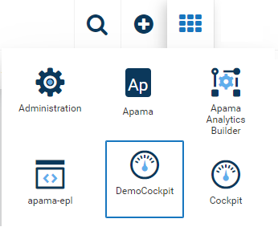
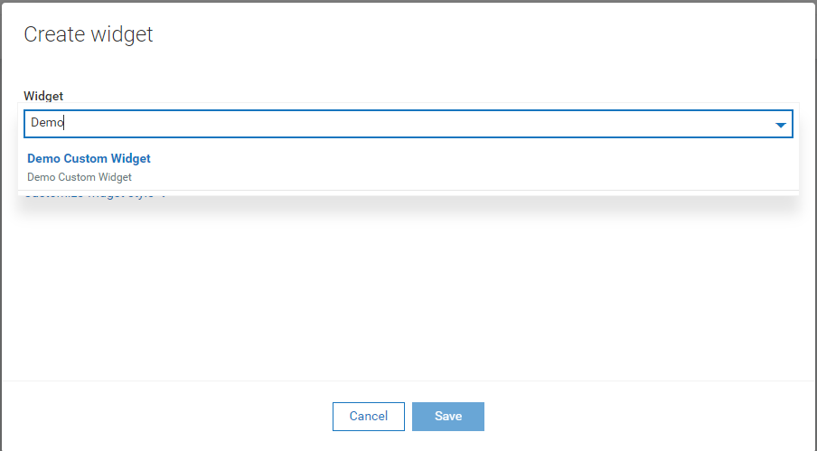
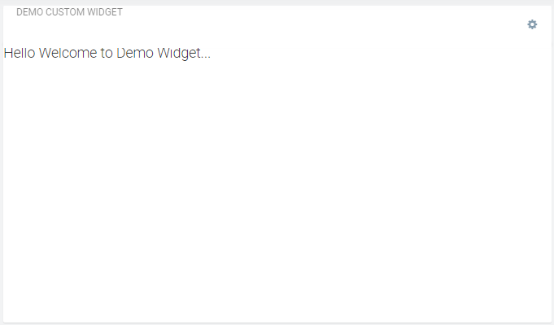
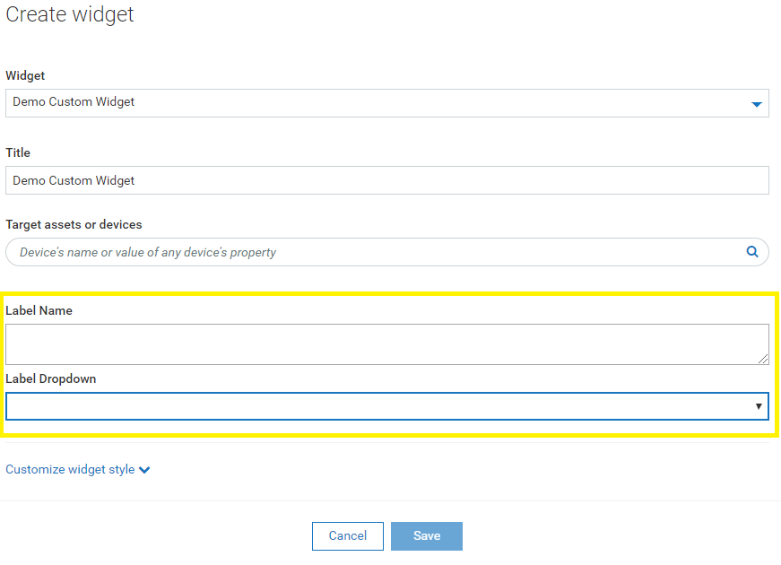

# How to Create Custom Widget in a Custom Application using webSDK & Angular 2 and above.

### Prerequisites

1. Node & NPM
2. c8y CLI
   
        npm install -g @c8y/cli
   
3. This feature is only available in the newer versions of the c8y webSDK (since 10.4.11.0).

democokpit - is custom application with custom widget example to test/refer.

## Steps to create Custom Application

1. Create Custom Application by cloning default cockpit
   
   c8ycli new <<name_of_application>> cockpit
   
         ex:c8ycli new DemoCockpit cockpit
   
   We use the webSDK library for Angular to create custom application by providing the cockpit as template to clone.
   
2. Install all the packages using npm install. Change Directory to the new custom application directory
    
      cd <<name_of_application>>
      
            ex: cd democockpit
    
    Now Run NPM install
    
            npm install
      
   This will install all dependent packages that are needed.
   The new custom cockpit will have all features of default cockpit. Below steps will help create custom widget that you can use
   to add to the dashboard in your custom application.

## Steps to Add Custom Widget
  
    Add a folder inside your application ex: custom-widgets/demo-widget
    
    ex: 
         mkdir custom-widgets
         
         cd custom-widgets
         
         mkdir demo-widget
    
### We need: 
    Widget Component, 
    Widget Config, 
    and finally Add Widget to Custom Application (i.e., in app.module.ts)

1. Create Widget Component.
    
    a. Create folder for Widget Component.
       ex: custom-widgets/demo-widget/widget
       
    b. Create three files
    
          1. html file - to add any inputs that you need for the Widget.
    
          2. .scss file - for styling.
          
          3. type script file - a component and logic goes here. Note this will have property @Input() config; that is imported from Angular core.

2. Create Widget Config.

    a. Create folder for Config Component.
       ex: custom-widgets/demo-widget/configuration
       
    b. Create three files
          1. html file - to add any inputs that you need for the Widget.
          2. .scss file - for styling.
          3. type script file - a component to store the config. Note this will have property @Input() config: any = {}; that is imported from Angular core.
          
3. Add Widget to Custom Application (in app.module.ts)

   a. Import HOOK_COMPONENT from @c8y/ngx-components
   
         import { HOOK_COMPONENT } from '@c8y/ngx-components';
   
   b. Import Widget Component that you created in step 1
   
         import { WidgetDemo } from './demo-widget.component';
   
   c. Import Widget Configuation that you created in step 2
   
         import { WidgetConfigDemo } from './demo-widget-config.component';
    
    d. Add the Widget Component and Widget Configuration into declarations & entryComponents
    
         @NgModule({
           imports: [
             BrowserModule,
             RouterModule.forRoot([
               ...UPGRADE_ROUTES
             ], { enableTracing: false, useHash: true }),
             .....
           ],
           // ---  addd BELOW ----
           declarations: [WidgetDemo, WidgetConfigDemo],
           entryComponents: [WidgetDemo, WidgetConfigDemo],
           
    e. Add Custom Widget to the Application as a Provider
    
        declarations: [WidgetDemo, WidgetConfigDemo],      
        entryComponents: [WidgetDemo, WidgetConfigDemo],
        // ---  addd BELOW; If you have multiple you will add another provide as Hook Component into Providers ----
        providers: [{
          provide: HOOK_COMPONENT,                         
          multi: true,
          useValue: {
            id: 'demo.custom.widget',                        
            label: 'Demo Custom Widget',
            description: 'Demo Custom Widget',
            component: WidgetDemo,                         
            configComponent: WidgetConfigDemo,
          }
        }],
 
 4. Build and Deploy
      
         c8ycli build
      
         c8ycli deploy
 
 5. You should now be able to see your Custom Application in App Switcher. Open that Custom Cockpit
 
 
 
 6. Got to the Dashboard where you want to add your custom widget and click on Add Widget.
 
         You should now see the Custom Dashboard when searched with the Display Name provided above
         

 7. Once added, you will see your custom widget added to your dashboard.
         

 8. DONE

## How TO DO

### How to Add input fields to the custom widget configuration window

   1. Update the html file in the configuration file as below
         
            

               <c8y-form-group>
                  <label translate>Label Name</label>
                  <textarea style="width:100%" [(ngModel)]="config.lableType"></textarea>
                  
                  <label translate>Label Dropdown</label>
                  <select name="groupType" [(ngModel)]="config.labelGroup">
                     <option *ngFor="let c of labelGroups" [value]="c.id">{{c.name}}</option>
                  </select>
               </c8y-form-group>
            

            
   2. For drop-down values labelGroups, add property in the typescript file of the Widget Configuration
   
            labelGroups = [
               {id: 1, name: "One"},
               {id: 2, name: "Two"}
            ];
   
   3.You can now refer and use this data in your custom widget type script code, as below
   
            this.config.lableType
            this.config.labelGroup

   You can see the input in the custom widget configuration screen
   

## How to get device id where this widget & dashboard is used / created

   You can fetch the details using.
      
         this.config.device.id
         
   Note: This is used to get mangedObject Id of both Device and Group.
